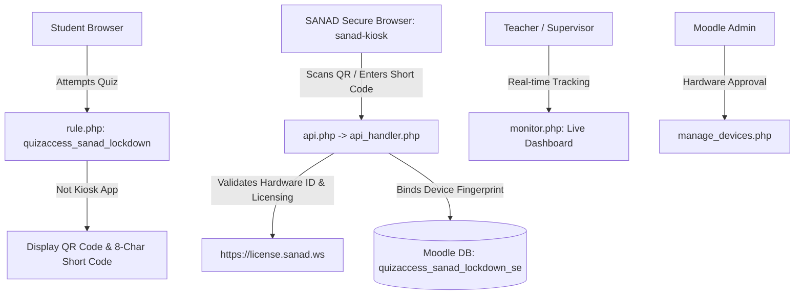

# 🤖 Antigravity & Agent Knowledge Root: SANAD Lockdown (`quizaccess_sanad_lockdown`)

> **Repository**: `engfeda-ui/sanad_lockdown` (Branch: `master`)  
> **Project Identity**: SANAD Lockdown — Moodle Quiz Access Rule Plugin for SANAD Secure Browser  
> **Plugin Type**: `quizaccess` (Path: `mod/quiz/accessrule/sanad_lockdown`)  
> **Component Name**: `quizaccess_sanad_lockdown`  
> **Active Version**: `v1.7.2 (Build 2026092601)`  
> **Target Moodle**: 4.5 LTS to 5.0+ | **PHP Target**: 8.2 & 8.3  
> **Core Stack**: Native Moodle PHP, Form API, Access Rule Base, External Services, Scoped CSS  

---

## ⚡ Quick Agent Reference & Infrastructure Map

| Parameter | Value | Notes |
|---|---|---|
| **Production LMS Server** | `150.230.241.37` | `https://lms.sanad.ws` |
| **SSH Key (LMS)** | `C:\Users\mahmo\Documents\ssh-key-2026-07-10 (production lms).key` | User `ubuntu` |
| **Remote Host Path** | `/home/ubuntu/moodle-project/mod/quiz/accessrule/sanad_lockdown/` | Production container mount |
| **Production Web & Licensing** | `193.122.76.88` | `sanad.ws`, `license.sanad.ws`, `kiosk.sanad.ws` |
| **Custom App Scheme** | `sanad-kiosk://launch-quiz?quiz_id=...&token=...` | Kiosk Launch Intent |
| **External Service Name** | `quizaccess_sanad_lockdown_get_launch_token` | Integrated into Moodle Mobile App |
| **Quality Harness Runner** | `npm run test:gates` | Zero-dependency verification gates (100% green) |
| **AI Advisory Runner** | `npm run adviser -- "..."` | Powered by `agency-agents` + OpenCode |

---

## 🚀 Mandatory Production Deployment Runbook

Whenever an update, bug fix, or feature is added to `sanad_lockdown`:

```powershell
# 1. Run local zero-dependency quality harness
npm run test:gates

# 2. Package plugin artifact
powershell -ExecutionPolicy Bypass -File "c:\Users\mahmo\OneDrive - Energy & Water Academy\Work\Repo\package_moodle_plugins.ps1"

# 3. Direct SSH Deployment to Production LMS Server (150.230.241.37)
$sshKey    = "C:\Users\mahmo\Documents\ssh-key-2026-07-10 (production lms).key"
$remote    = "ubuntu@150.230.241.37"
$localPath = "c:\Users\mahmo\OneDrive - Energy & Water Academy\Work\Repo\sanad_lockdown"
$remotePath = "/home/ubuntu/moodle-project/mod/quiz/accessrule/sanad_lockdown/"

cmd /c "tar -czf - -C `"$localPath`" --exclude='.git*' --exclude='node_modules' . | ssh -i `"$sshKey`" -o StrictHostKeyChecking=no $remote `"sudo mkdir -p $remotePath && sudo tar -xzf - -C $remotePath`""
ssh -i $sshKey -o StrictHostKeyChecking=no $remote "sudo docker exec -u www-data moodle-app php /var/www/html/admin/cli/upgrade.php --non-interactive && sudo docker exec -u www-data moodle-app php /var/www/html/admin/cli/purge_caches.php"

# 4. Live Verification
curl -s -k -I https://lms.sanad.ws
```

---

## 🏛️ Architecture & Component Matrix



### Component Details:
1. **`rule.php`**:
   - Extends `quiz_access_rule_base` with backward compatibility aliases for older Moodle versions.
   - Enforces lockdown policy, renders preflight QR code launch page, and checks session validity on each quiz page load.
2. **`api.php` & `classes/api_handler.php`**:
   - Thin REST router and modular dispatcher handling `resolve_code`, `check_license`, `heartbeat`, `log_violation`, and `verify_exit`.
   - Rate limits requests per device and IP to eliminate brute-force vector on short codes.
3. **`classes/token_manager.php`**:
   - Signs session tokens using HMAC-SHA256 with site-wide secrets.
   - Binds and enforces device fingerprints on every subsequent quiz attempt.
4. **`classes/external/get_launch_token.php`**:
   - Registered Moodle External Web Service allowing SANAD Learn mobile app to fetch valid launch tokens and deep links seamlessly.
5. **`tests/` (Zero-Dependency Quality Harness)**:
   - `tests/run-all.js`: Master test suite runner.
   - `tests/syntax-check.js`: Validates all PHP source files with `php -l`.
   - `tests/i18n-check.js`: Verifies 100% key parity between English and Arabic language files.
   - `tests/contract-check.js`: Verifies Moodle metadata, API return types, and absence of raw superglobals.
   - `tests/smoke.js`: Comprehensive plugin integrity and scoped CSS checker.

---

## 📋 Changelog History

### [v1.7.2] - 2026-09-26
* **Security & Cleanliness**: Eliminated direct `$_SESSION` usage across the plugin in favor of standard Moodle global `$SESSION`.
* **Security & Standards**: Refined parameter cleaning in `token_manager.php` and external service return types (`get_launch_token.php`) from `PARAM_RAW` to strictly typed `PARAM_NOTAGS`, `PARAM_RAW_TRIMMED`, and `PARAM_URL`.
* **URL Compliance**: Transitioned URL generation in `build_launch_url()` to standard Moodle `moodle_url` objects.
* **i18n Parity**: Synchronized English and Arabic string keys (`regeneratepassword`, `alloweddomains`) achieving 100% language parity across all 84 keys.
* **Quality Harness**: Integrated Zero-Dependency Quality Gates (`tests/run-all.js`, `tests/syntax-check.js`, `tests/i18n-check.js`, `tests/contract-check.js`, `tests/smoke.js`).
* **Multi-Agent Advisory**: Added `scripts/opencode-adviser.js` connected to `agency-agents` and OpenCode models.
